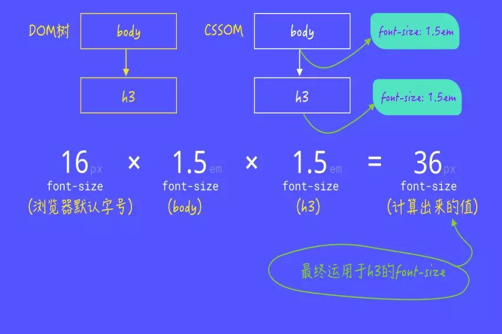
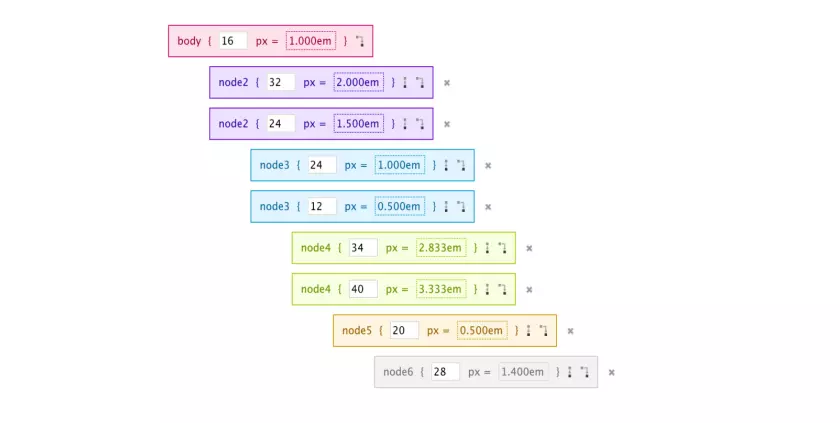
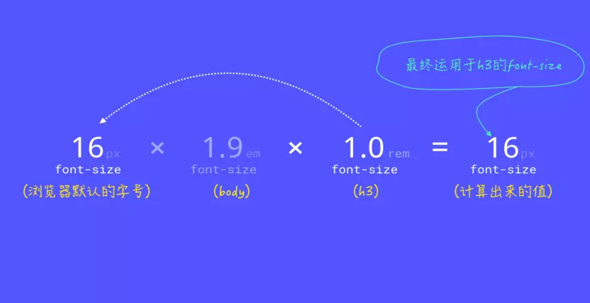

### bable 的配置
- env：指定在不同环境下使用的配置。比如production和development两个环境使用不同的配置，就可以通过这个字段来配置。env字段的从process.env.BABEL_ENV获取，如果BABEL_ENV不存在，则从process.env.NODE_ENV获取，如果NODE_ENV还是不存在，则取默认值"development"
- plugins：要加载和使用的插件列表，插件名前的babel-plugin-可省略；plugin列表按从头到尾的顺序运行
- presets：要加载和使用的preset列表，preset名前的babel-preset-可省略；presets列表的preset按从尾到头的逆序运行（为了兼容用户使用习惯）
同时设置了presets和plugins，那么plugins的先运行；每个preset和plugin都可以再配置自己的option

#### presets
如果要自行配置转译过程中使用的各类插件，那太痛苦了，所以babel官方帮我们做了一些预设的插件集，称之为preset，这样我们只需要使用对应的preset就可以了。以JS标准为例，babel提供了如下的一些preset：
- es2015
- es2016
- es2017
- env
es20xx的preset只转译该年份批准的标准，而env则代指最新的标准，包括了latest和es20xx各年份另外，还有 stage-0到stage-4的标准成形之前的各个阶段，这些都是实验版的preset，建议不要使用。

.babelrc
```
{
  "presets": [
    
    [
      "@babel/preset-env",
      {
        "modules":false
      }
    ],
    [
      "@babel/preset-react",
      {
        "modules":false
      }
    ]
  ],
  "plugins": [],
  "compact": false
}
```
# REM 自适配移动端

### em 和 rem


em：

在CSS 中，如果没有任何 CSS 规则影响的前提之下，通常情况下：

1em的长度是：1em = 16px = 0.17in = 12pt = 1pc = 4.mm = 0.42cm
```
<body style=“font-size:1.5em”>

<h3 style=“font-size:1.5em”>哈哈哈<h3>

<body>
```



从上面的简单示例，我们可以得知，随着DOM 元素的嵌套加深，同时不同层级都显式设置font-size的值为em，那将会增加em计算和转换的复杂度。像这样：



所以：1 ÷ 父元素的font-size × 需要转换的像素值 = em值

如果在非font-size的属性上使用em做为<length>值的单位时，将会受元素font-size的影响。在众多开发者中有一个比较普遍的语解，认为em单位是相对于父元素的font-size。而事实上呢？它们是相对于使用em单位元素的font-size。父元素的font-size可以影响em值，但这种情况的发生，纯粹是因为继承。

em单位除了应用于font-size属性之外，还可以运用于可以使用<length>值的其他属性，比如width、margin、padding、border-width和text-shadow等等。

rem：rem相对于em而言没有那么复杂，他仅仅是相对于根元素<html>的font-size计算

任何值为1rem的元素都等于16px，当然，其前提是浏览器默认的font-size没有被用户重置，或者未显式的给html元素设置font-size值；另外，rem可以不管它的父元素的font-size如何！



Ps:适合的才是最好的

·  rem和em在客户端中计算出来的样式值都会以px显式

·  rem相对于根元素html的font-size计算，em相对于元素font-size计算

·  rem可以从浏览器字体设置中继承font-size值，em可能受任何继承过来的父元素font-size的影响

·  使用em应该根据组件的font-size来定，而不是根元素的font-size来定

·  在不需要使用em单位，并且需要根据浏览器的font-size设置缩放时，应该使用rem

SO 适配的解决方案可以以下步骤
1.在静态资源 ./public/rem.js 创建 rem.js
```
(function () {
  var docEl = document.documentElement;
  function setRemUnit() {
    var rem = docEl.clientWidth / 10;
    docEl.style.fontSize = rem + 'px';
  }
  
  setRemUnit();
  window.addEventListener('reszie', setRemUnit());
})();
```
2.在 index.html 引入 
```
<!DOCTYPE html>
<html lang="en">

<head>
  <meta charset="UTF-8">
  <meta name="viewport" content="width=device-width, initial-scale=1.0,maximum-scale=1">
  <meta http-equiv="X-UA-Compatible" content="ie=edge">
  <title>外卖</title>
  <link rel="stylesheet" type="text/css" href="reset.css">
  <script src="./rem.js"></script>
</head>
```
3.添加 scss 方法

px2rem.scss 文件
```
@function px2rem($px) {
  $rem: 37.5px;
  @return ($px / $rem) + rem;
}
```
4.修改 webpack.config.base.js 为了能全局引用
```
 {
        test: /\.scss$/, 
        exclude: /node_modules/,
        use: [
          'style-loader', 
          'css-loader', 
          'sass-loader',
          {
            loader: 'sass-resources-loader',
            options: {
              resources: path.resolve(srcRoot,'../src/common/styles/px2rem.scss')
            }
          }
 }

 5.在用  px 单位的地方修改 
 ```
  .act-tab-icon {
      width: px2rem(25px);
      height: px2rem(25px);
      background-size: cover;
      margin-bottom: px2rem(4px);
      background-repeat: no-repeat
    }
 ```

### 1px 边框
```
.scale-1px {
  position: relative;
  border: none;
}

.scale-1px:after {
  content: '';
  position: absolute;
  height: 1px;
  width: 100%;
  bottom: 0;
  left: 0;
  -webkit-transform: scaleY(0.5);
  transform: scaleY(0.5);
  -webkit-transform-origin: 0 0;
  transform-origin: 0 0;
}
```

### 滚动加载
1. 滚动页面到底部 公式 = 'document.documentElement.scrollTop + document.body.scrollHeight > document.documentElement.clientHeight'
```
useEffect(() => {
    function onPageLoader() {
      let scrollTop = document.documentElement.scrollTop;
      let scrollHeight = document.body.scrollHeight;
      let clientHeight = document.documentElement.clientHeight;
      let proLoadDis = 30;
      if ((scrollTop + clientHeight) >= (scrollHeight - proLoadDis)) {
        console.log(`on page scroll load.....`);
        if (page < 3) {
          setPage(page + 1)
          props.featchData(page);
        }
        else {
          setSent(true);
        }
      }
    }
    window.addEventListener('scroll', onPageLoader)
    return () => {
      window.removeEventListener('scroll', onPageLoader)
    }
  }, [page])
```

### 路由参数的传递
1. params
```
<Route path='/path/:name' component={Path}/>
<link to="/path/2">xxx</Link>
this.props.history.push({pathname:"/path/" + name});
读取参数用:this.props.match.params.name
```
2. query
```
<Route path='/query' component={Query}/>
<Link to={{ path : ' /query' , query : { name : 'sunny' }}}>
this.props.history.push({pathname:"/query",query: { name : 'sunny' }});
读取参数用: this.props.location.query.name
```
3. state
```
<Route path='/sort ' component={Sort}/>
<Link to={{ path : ' /sort ' , state : { name : 'sunny' }}}> 
this.props.history.push({pathname:"/sort ",state : { name : 'sunny' }});
读取参数用: this.props.location.query.state 
```
4.search
```
<Route path='/web/departManange ' component={DepartManange}/>
<link to="web/departManange?tenantId=12121212">xxx</Link>
this.props.history.push({pathname:"/web/departManange?tenantId" + row.tenantId});
读取参数用: this.props.location.search
```

```
1, window.location.href
      整个URl字符串(在浏览器中就是完整的地址栏)
      本例返回值: http://www.x2y2.com:80/fisker/post/0703/window.location.html?ver=1.0&id=6#imhere

2,window.location.protocol
      URL 的协议部分
      本例返回值:http:

3,window.location.host
      URL 的主机部分
      本例返回值:www.x2y2.com

4,window.location.port
      URL 的端口部分
      如果采用默认的80端口(update:即使添加了:80)，那么返回值并不是默认的80而是空字符
      本例返回值:""

5,window.location.pathname
      URL 的路径部分(就是文件地址)
      本例返回值:/fisker/post/0703/window.location.html

6,window.location.search
      查询(参数)部分
      除了给动态语言赋值以外，我们同样可以给静态页面,并使用javascript来获得相信应的参数值
      本例返回值:?ver=1.0&id=6

7,window.location.hash
      锚点
      本例返回值:#imhere <src="http://feeds.feedburner.com/~s/fisker?i=http://www.x2y2.com/fisker/post/0703/window.location.html" type="text/javascript" charset="utf-8">
```

### 多页构建

```

//提取公共模块
  optimization: {
    splitChunks: {
      cacheGroups: {
        common: {
          test: /[\\/]node_modules[\\/]/,
          chunks: 'all',
          name: 'common'
        }
      }
    }
  },

//多页构建
entry: {
  //app 模块
  app: path.resolve(__dirname, '../src/page/index/index.jsx'),
  //详情分类
  category: path.resolve(__dirname, '../src/page/category/index.jsx')
},

// app 模块
new HtmlWebpackPlugin({
  template: path.resolve(__dirname, '../src/page/index/index.html'),
  filename: 'index.html',
  chunks: ['common', 'app']
}),
    
// category 模块
new HtmlWebpackPlugin({
  template: path.resolve(__dirname, '../src/page/category/category.html'),
  filename: 'category.html',
  chunks: ['common', 'category']
}),

```

### redux-logger 的使用
```
import logger from 'redux-logger';
some code .....
export const appStore = () => {
  some code.....
  cliStore = createStore(reducers, composeEnhancers(
    applyMiddleware(thunk,logger)
  ))
  some code.....
}

```
#### babel 支持async await  @babel/runtime @babel/polyfill

```
.babelrc
"plugins": [
    [
      "@babel/plugin-transform-runtime",
      {
        "absoluteRuntime": false,
        "corejs": false,
        "helpers": true,
        "regenerator": true,
        "useESModules": false
      }
    ]
  ]
```